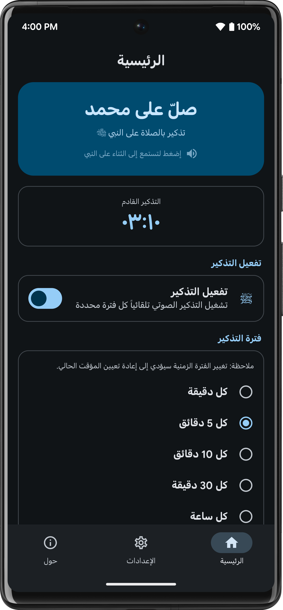
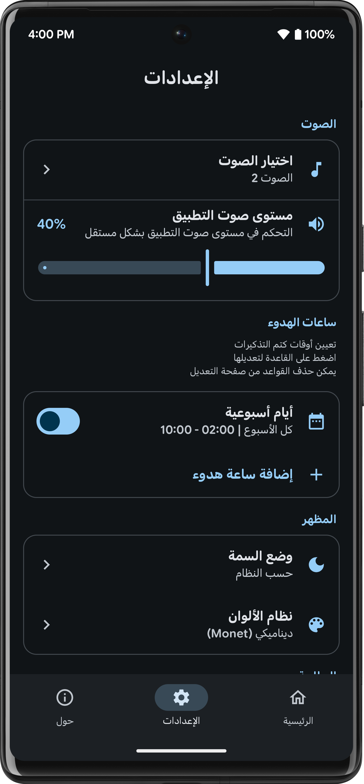
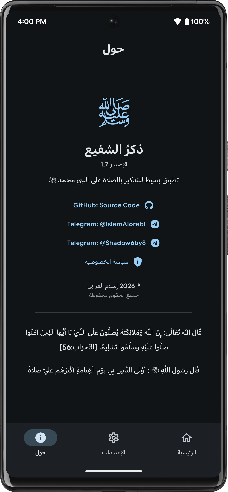

# ShafeeZekr


**ShafeeZekr** (ذكرُ الشفيع) is a modern Android application designed to remind you to send blessings upon the Prophet Muhammad (Peace Be Upon Him). Built with Jetpack Compose and Material Design 3, it provides a beautiful, customizable experience with multi-language support and privacy-focused design.

<br clear="all" />

## Features

### 🔔 Reminders
- **Periodic Audio Reminders**: Set automatic reminders at customizable intervals (1 minute to 2 hours, or fully custom intervals)
- **Live Countdown Timer**: See the time remaining until your next reminder on the home screen
- **Quiet Hours**: Configure time-based rules to pause reminders — supports weekly schedules and specific dates, with conflict detection
- **Boot Persistence**: Reminders automatically resume after device restart
- **Battery Optimization Handling**: Intelligent management of battery optimization settings for reliable reminder delivery

### 🎵 Sound & Volume
- **Multiple Sound Options**: Choose from various reminder sounds with instant preview
- **Independent Volume Control**: App-level volume slider that temporarily overrides system volume during playback

### 🧩 Widgets
- **Salawat Widget**: Home screen widget with Material You theming and a play sound button
- **Icon Widget**: Compact 1×1 icon widget that plays zikr sound on tap
- Built with **Jetpack Glance** for native Material 3 integration

### ⚡ Quick Settings Tile
- **Pause/Resume Tile**: Toggle Dhikr reminders directly from the notification shade without opening the app
- Supports `requestAddTileService()` for easy setup on Android 13+

### 🎨 Appearance
- **Material Design 3**: Dynamic color theming with Monet, Light/Dark mode support, and smooth animations
- **Color Schemes**: Choose from 8 color palettes — Monet (dynamic), Green, Blue, Purple, Teal, Orange, Pink, Red
- **Localized Numerals**: Numbers automatically display in Arabic, Persian, or Urdu numerals based on the selected language

### 🌍 Multi-Language Support
Fully localized in 8 languages with system language auto-detection:
- English
- Arabic (العربية)
- Indonesian (Bahasa Indonesia)
- Russian (Русский)
- German (Deutsch)
- Urdu (اردو)
- Persian (فارسی)
- Turkish (Türkçe)

### 🔒 Privacy
- No data collection, no tracking, no analytics, no ads
- Works completely offline — no internet required
- Open source — see our [Privacy Policy](PRIVACY_POLICY.md)

## Screenshots

<p align="center">
  
  
  
</p>

## Requirements

- Android 12 (API 31) or higher
- Android Studio Ladybug or newer
- JDK 11+

## Installation

1. Clone the repository:
   ```bash
   git clone https://github.com/islamalorabi/ShafeeZekr.git
   ```
2. Open the project in Android Studio
3. Sync Gradle files
4. Build and run on your device or emulator

## Tech Stack

| Layer | Technology |
|-------|-----------|
| **Language** | Kotlin |
| **UI Framework** | Jetpack Compose |
| **Design System** | Material 3 (Monet dynamic colors) |
| **Widgets** | Jetpack Glance + Glance Material 3 |
| **Data Persistence** | DataStore Preferences |
| **Architecture** | MVVM |
| **Networking** | Retrofit 3.0 + Gson |
| **Build** | AGP 9.0, Compose BOM 2026.01.01 |
| **Min SDK** | 31 (Android 12) |
| **Target SDK** | 36 |

## Contributing

Contributions are welcome. To contribute:

1. Fork the repository
2. Create a feature branch (`git checkout -b feature/YourFeature`)
3. Commit your changes (`git commit -m 'Add some feature'`)
4. Push to the branch (`git push origin feature/YourFeature`)
5. Open a Pull Request

## Contact

- Telegram: [@IslamAlorabI](https://t.me/IslamAlorabI)
- GitHub: [github.com/islamalorabi](https://github.com/islamalorabi)

## License

This project is licensed under the MIT License. See the [LICENSE](LICENSE) file for details.
